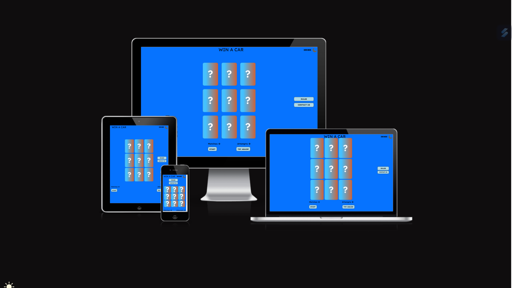
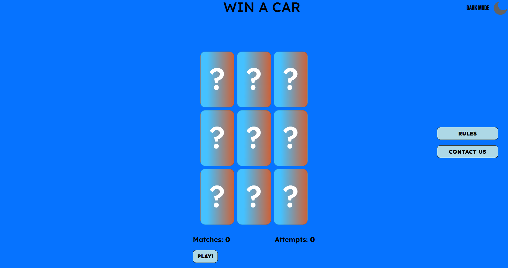
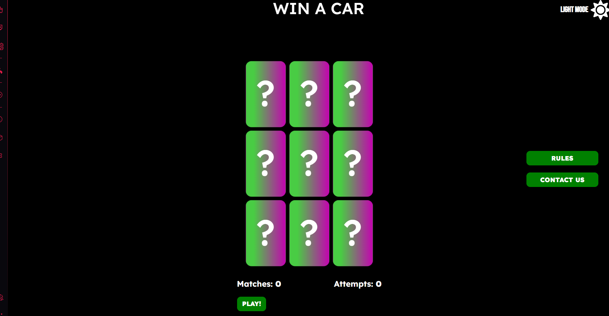
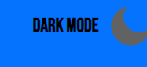
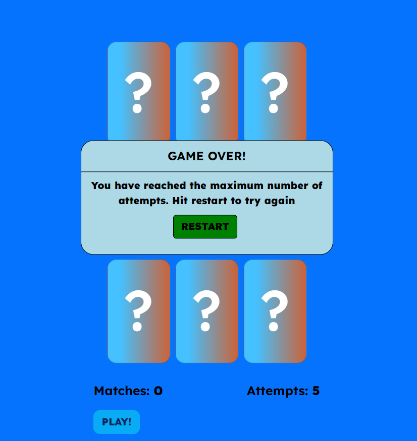
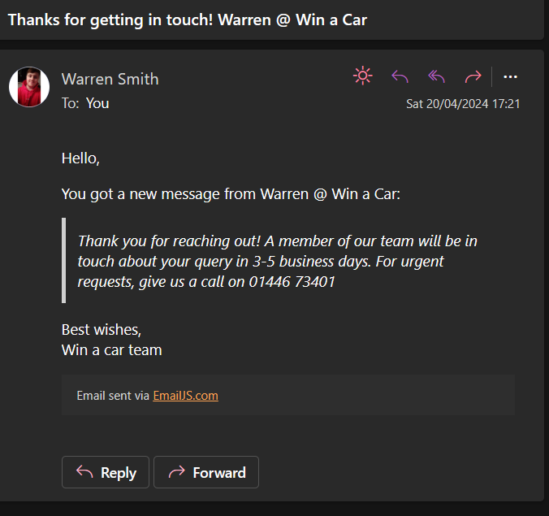
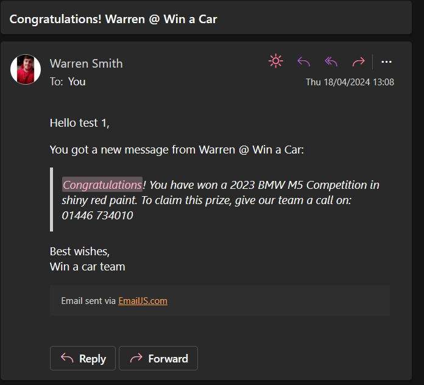
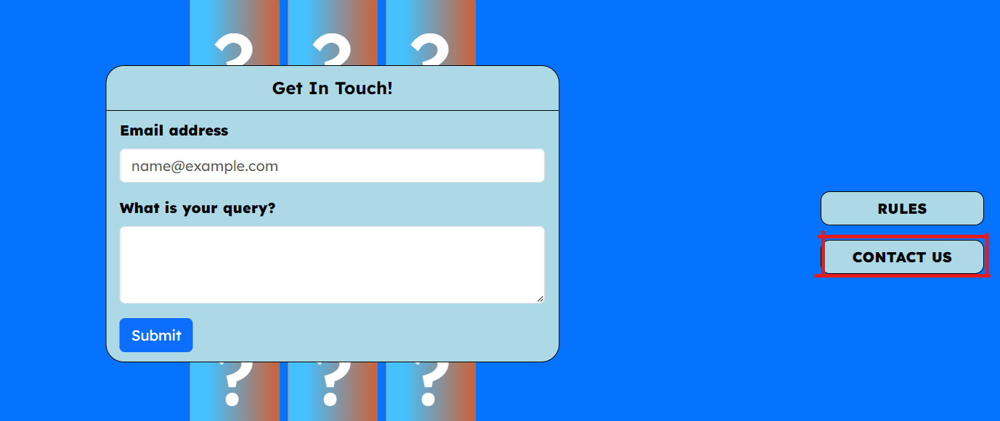
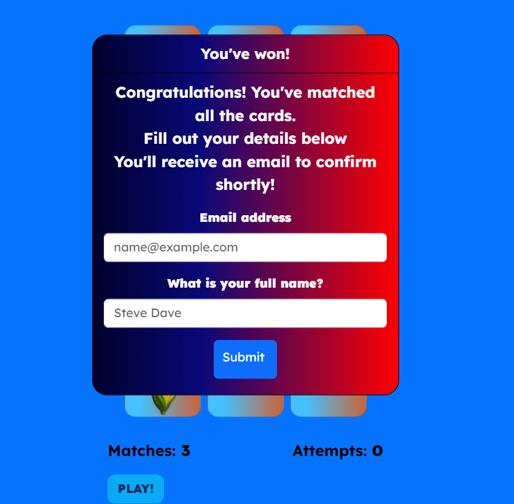
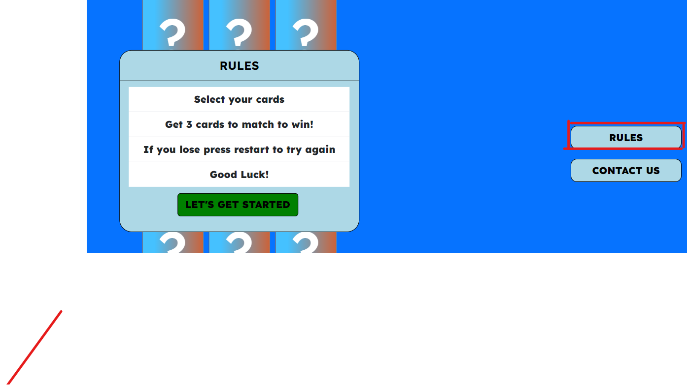

# Win a car

Win a car is a simple 3 select card game with the goal of matching 3 cards to win a shiny new car!

To get started you just need to hit the start button and start selecting cards. Once you select 3 cards if you don't get a match hit try again. You only get 5 attempts per go!

Once 5 attempts as been made, a game over screen will pop up and you can hit restart to try again. One you match 3 cards a pop up will appear containing a form asking for your name and email address, once this is filled in and submitted you will receive an email confirming your prize.

Win a car also has a dark mode toggle for the keen dark mode enthusiasts out there!

 

[You can visit the Win a car website here](https://wxrren.github.io/win-a-car/)
------

## Table of Contents

### [User Experience (UX)](#user-experience-ux)
* #### [User Stories](#user-stories)
* #### [WireFrames](#wire-frames) (View the repository [here](https://github.com/Wxrren/win-a-car/tree/main/assets/images/wireframes))
* #### [Design](#design-1)

### [Features](#features-1)
* #### [Existing Features](#existing-features-1)
* #### [Features Left to Implement](#features-left-to-implement-1)

### [Bugs](#bugs-1)

### [Testing](#testing-1)
* #### [Validation Results](#validation-results-1)
* #### [Manual Testing](#manual-testing-1)
* #### [Lighthouse Report](#lighthouse-report-1)

### [Technologies Used](#technologies-used-1)

### [Frameworks, Libraries & Programs Used](#frameworks-libraries--programs-used-1)

### [Deployment and local development](#deployment-and-local-development-1)
* #### [GitHub Pages](#github-pages-1)
* #### [Forking the GitHub Repository](#forking-the-github-repository-1)
* #### [Local Clone](#local-clone-1)

### [Credits](#credits-1)

### [Acknowledgements](#acknowledgements-1)
------

## User Experience (UX)

There is a clear navigation in the nav bar which directs you on where to join the league or sign up to competitions. It directs you to a tournaments gallery Where pictures of tournaments others have competed in can be viewed.

The website is a simple single page that makes use of modals instead of diverting to other pages. When selecting the modals users can either check the rules, submit a query/complaint and enter their email details should they win the game.

Users can also switch between light and dark mode by selecting the moon logo on the top right corner. 

To make the user experience easy - I wanted the site to have:

* A simple call to action in the form of the "Play!" button which also turns to a "Next Turn" button after the 1st attempts are made.
* A simple UI. I wanted minimal buttons appearing on the screen to make it less cluttered focussing only on what they need to play the game or ask any questions.
* Fast game that's responsive to user actions.

## User Stories
To determine which approach to take with site features I detirmined the goals of different users from first time through to frequent users.

### User

* First time User Goals
    * As a user I want to understand the main purpose of the site and get straight into the game.
    * As a user I want to understand the rules of how I can play the game.
    * As a user I want to be able to easily navigate the site.
    
* Returning User Goals
    * As a user I want to be get straight into the action with playing
    * As a user I want to be able to easily contact and provide feedback if something goes wrong.
    
* Frequent User Goals
    * As a user I want to be able to get started quickly
    * As a user I want to see a simple and easy website with no added bloat since the last attempt.

## Wire Frames

When designing this website I intended to have a very minimal design that didn't distract from the card game. The design was intended to look the same across all devices.

I chose to keep one simple page and make usage of modals for anything else needed

### Home Page - Wireframe for Desktop, Tablet and Mobile.

* Mobile

For the "Rules" and "Contact" button I chose to put these at the top of the page due to limited space on the sides. I want the card game to be the main focus. Modals will pop up in front of the fact game in the middle of the screen.

## Design

### Colour

The colour scheme I wanted for the website was simple and clean. I chose colours to try and follow the 10 commandments of colour and complement the colors see on the site.

For the background of lightmode I chose a simple blue as it felt calm and inviting and for darkmode it was a simple black. The card colours change depending on if it's lightmode or darkmode. For lightmode I chose a lightblue and orange to go together. In darkmode I chose green and pink. Both of these show across from eachother on the colourwheel.

### Website lightmode and darkmode

* Light mode
    
    

* Dark mode

 

* Main colours used on the website:
    * Background colour: rgba(6, 115, 255, 1) - This was chosen as a nice cool and inviting background that didn't take too much away from the main card game. 
    * Modals and button colours: #add8e6, #008000,  - This was to keep with the theme of simple and easy to read colours which matches the light mode and dark mode colours of the cards to keep a simple theme.
    * Dark mode modal button color: #0d6efd - The above colour in darkmode was not very readable with plain white text. I wanted the text to be as regimented as possible so changed the colours.
    * Light mode card colours: rgba(85, 213, 255, 0.8) + rgba(255, 94, 6, 0.8) - These were chosen in an effort to follow the ten commandments of colour. They are across from eachother on the colour wheel and both compliment eachother making the cards look more enticing.
    * Dark mode card colours: rgba(92, 255, 85, 0.8) + rgba(246, 3, 221, 0.8). Similar to lightmode these compliment eachother on the colour wheel and are aimed to make the cards look more attractive to players.
    * Game winning Modal: rgba(1, 1, 44, 1) + rgba(9, 9, 121, 1) + rgba(255, 0, 0, 1) - I wanted the winning modal to stand out as a celebratory message. For this modal only I chose to break the colour rule and reused the colours from my first project. This was done as a small little reference for my past work.

### Typography

* Lexend
    * I chose Lexend from Google Fonts as I felt it kept well enough with the theme of being clear and readable. I wanted all buttons and modals to be as easy to read as possible.

* Bebas Neue
    * For the dark/light mode toggles I wanted text next to the moon labels to make it as clear as possible what they would do. I chose this font from Google Fonts as it was an easy regimented bold font that stoof out from the rest of the text used elsewhere.

### WireFrames

I created my wireframes using balsamiq wireframes. I found this simple and effective for assessing the sites appearance as it had a variety of ready available tools representing different parts of a website so I was able to design it how I envisioned it.

## Features
* This website is a simple to use card game.
* Users can select the 3 cards to match and after 5 attempts can restart the game to try again.
* Responsive on all device sizes.

### Existing Features

#### Dark Mode Toggle

* The toggle is fixed to the top right of the page at all times.
* Once clicked the background will turn black and cards will change to a pink and green colour, text will turn white and buttons will turn green. 
* On light mode the logo is a moon. In dark mode the logo is a sun.
* Text changes from "Dark mode" to "Light mode" when toggled between.
* Easily accessible for the user, can be toggled at anytime.

#### Main Feature - Card game

* Main game, when pressing play a modal will pop up wishing the player luck and letting them know to hit next turn after selecting 3 cards.
* Each card has an array of 9 images which will be called at random when the card is selected.
* The play button will change to "Next turn!" after the first attempt is made.
* Matches counter will count as each card selected matches the previous card. This is done by running 2 loops and checking if the card from the inner loop matches the card from the outer loop.
* Each time 3 cards are selected the game will automatically refresh the page. Progress is saved in local storage so when the page refreshed it increments how many attempts have been taken so far.
* If more than 5 attempts are taken a modal wil a game over screen will pop up promting you to restart as seen below.

#### Email API

* An automatic response email that would confirm to users they will have their query responded to. It also provides a contact number to escalate. This email will be received when the form within the "Contact us" modal form seen below is completed. The data taken from user input is passed into the email API. This is done by creating a global variable for contact form data and defining it within each mail function.

* The email win feature is set up the same way as above. When a user selected 3 cards and matches 3 in a row a game winning modal will pop up requesting their name and email address. From here an email will be sent confirming the prize and how to claim.

#### Rules modal

* A simple modal that pops up when the button is clicked.
* Displays the rules to the player before they close it to get started on playing the game.

## Features Left to Implement

* Payment
   
    * To go more with the gambling sort of nature of the game I would like to make the first 5 attempts free to play and make it so that upon game loss users would have to pay to enter again and get another 5 attempts.

* Different Themes

    * I would like to create a few pages with similar games but different themes, maybe a western theme with desert like colours and cowboy images. Different themes to make it more intersting and appealing to users.

* Different games
    * I would like the option to add different game modes of things like guess the box. You would see the prize enter the box and the boxes would then quickly moves around the screen, you would have 3 attempts to select the correct box. 